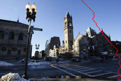

photocode

Code from an undergrad CS course about digital photography as offered in 2012.  Written in Python.

Projects included such topics as:
- contrast amd brightness adjustments
- lens [aberration](https://en.wikipedia.org/wiki/Chromatic_aberration) correction
- panorama stitching
- face morphing (as seen in Michael Jackson's [Black or White music video](https://youtu.be/3Iw-vUBo7v4))
- light field photography, like the [Lytro camera](https://en.wikipedia.org/wiki/Lytro)
- "seam carving" or "path of least resistance" cropping

    
    
    

